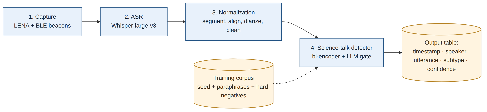

# Science Talk Retrieval — A Beginner's Guide to This Project

> **Audience:** someone joining the project with little or no background in
> machine learning / natural language processing (NLP). Every term is defined
> the first time it appears, and there is a full glossary at the end.

---

## Table of Contents

1. [What this project is about](#1-what-this-project-is-about)
2. [Core concepts and definitions](#2-core-concepts-and-definitions)
3. [The big picture: run-time system architecture](#3-the-big-picture-run-time-system-architecture)
4. [Repository layout](#4-repository-layout)
5. [The source data](#5-the-source-data)
6. [The corpus-prep pipeline, step by step](#6-the-corpus-prep-pipeline-step-by-step)
   - [Step 1 — Data ingestion & normalization](#step-1--data-ingestion--normalization-data_loader_1py)
   - [Step 2 — Sub-type labeling](#step-2--sub-type-labeling-subtypes_2py)
   - [Step 3 — Negative mining](#step-3--negative-mining-negatives_3py)
   - [Step 4 — Register-variant augmentation](#step-4--register-variant-augmentation-augment_4py)
   - [Step 5 — Frozen-baseline embedding pass](#step-5--frozen-baseline-embedding-pass-embeddings_baseline_5py)
   - [Step 6 — Confidence scoring & routing](#step-6--confidence-scoring--routing-confidence_5py)
   - [Step 7 — Train/val/test splits](#step-7--trainvaltest-splits-splitspy)
   - [Step 8 — Bi-encoder training](#step-8--bi-encoder-training-biencoder_8py)
   - [Step 9 — LLM pair re-ranker](#step-9--llm-pair-re-ranker-reranker_9py)
   - [Step 10 — Query-time pipeline](#step-10--query-time-pipeline-query_10py)
   - [Step 11 — Evaluation & threshold tuning](#step-11--evaluation--threshold-tuning-evaluate_11py)
   - [Step 12 — Y2 transcript scoring / deployment](#step-12--y2-teli-transcript-scoring--deployment-deploy_y2_12py)
7. [The LLM client and the cache](#7-the-llm-client-and-the-cache-llm_client_0py)
8. [Stub mode vs. real-LLM mode](#8-stub-mode-vs-real-llm-mode)
9. [The configuration file](#9-the-configuration-file-configconfidencejson)
10. [Human review loops](#10-human-review-loops)
11. [How to run everything](#11-how-to-run-everything)
12. [Tests](#12-tests)
13. [Current state of the data (as of the last pipeline run)](#13-current-state-of-the-data)
14. [Glossary (A–Z)](#14-glossary-a-z)

---

## 1. What this project is about

**The research question:** when a parent and a young child talk to each other
(in a museum, in a pre-K classroom, during play), some of what they say is
**science talk** — observations ("look, the ice is melting!"), predictions
("what do you think will happen if…?"), explanations ("it rolled down because
it's round"). Researchers at the Anita Zucker Center want to find these
moments automatically inside hours of recorded conversation, because hand-coding
audio transcripts is extremely slow and expensive.

**The engineering goal:** build a system that takes a raw audio recording and
returns a researcher-ready table of utterances that were probably science
talk, each tagged with *what kind* of science talk it is and a confidence
score.

**What this repository actually contains:** the **training-data factory** for
the detector — a 7-step pipeline that turns a small, expert-labeled spreadsheet
(~200 example utterances) into a much larger, quality-controlled training
corpus (~8,500 rows) suitable for fine-tuning a retrieval-style classifier.
The detector model itself (the "bi-encoder", Step 8) is the next phase and is
not in this repo yet.

**The two constraints that shaped everything:**

1. **The seed corpus is tiny** (~200 labeled utterances). You cannot train a
   large model from scratch on 200 examples, so the pipeline *stretches* the
   data: it generates paraphrases, mines real transcripts, and synthesizes
   tricky counter-examples using a large language model (LLM).
2. **False positives are expensive.** Every utterance wrongly flagged as
   science talk wastes researcher review time. So the pipeline is obsessed
   with *negatives* (non-science utterances that look like science) and with
   *quality control* (confidence scores, human audits, review templates).

---

## 2. Core concepts and definitions

These are the ideas you need before reading anything else. (The full A–Z
glossary is at the bottom.)

### Utterance
A single spoken "turn" or sentence — one row of a transcript. Example:
*"What do you think will happen if we add more water?"* This is the basic
unit everything in this project operates on.

### Label / classification
A **label** is the answer we want the machine to produce. Here the top-level
labels are `SCIENCE_TALK` and `NOT_SCIENCE_TALK`. **Classification** is the
machine-learning task of assigning a label to an input. A **classifier** is
the model that does it.

### Positive / negative examples
- A **positive** is an example of the thing we're looking for (a science-talk
  utterance).
- A **negative** is an example of what we're *not* looking for (small talk,
  classroom management, "put your shoes on").
- A **hard negative** is a negative that *looks deceptively like a positive*.
  "I wonder where your shoes are" mirrors the syntax of the scientific
  "I wonder why the ice melted" but is not science. Hard negatives are the
  most valuable training examples because they teach the model the actual
  decision boundary instead of superficial word cues.

### Embedding
A way of turning text into numbers. An **embedding model** (also called an
**encoder**) maps a sentence to a long list of numbers — a **vector** —
(here, 768 numbers) such that *sentences with similar meanings get vectors
that point in similar directions*. This lets a computer measure "how similar
in meaning are these two sentences?" with simple math.

### Cosine similarity
The standard way to compare two embedding vectors. It measures the angle
between them and returns a number from −1 to 1:
- **1.0** = pointing the same way (very similar meaning)
- **0.0** = unrelated
- **−1.0** = opposite

In this project, cosine similarity between an utterance and known science-talk
examples is the core detection signal.

### Bi-encoder
The architecture chosen for the detector. A **bi-encoder** runs *each* text
through the encoder **separately**, producing one vector per text, and then
compares the vectors (with cosine similarity). Advantages:

- You can embed your library of known science-talk examples (the **anchor
  bank**) *once*, ahead of time.
- At run time, classifying a new utterance only requires embedding *that one
  utterance* and comparing it against the pre-computed vectors. Very fast.

This makes detection a **retrieval** problem: "find the stored example most
similar to this new utterance" — which is why the project is called *Science
talk retrieval*.

### Cross-encoder / re-ranker
The complementary architecture. A **cross-encoder** feeds *both* texts into
the model **together** so the model can attend to the interaction between
their words. It is much more accurate but much slower (you can't pre-compute
anything; every comparison is a full model run).

A **re-ranker** is the standard way to use a cross-encoder in practice:
1. The fast bi-encoder retrieves the top-K candidate matches (cheap, recall-oriented).
2. The slow-but-accurate cross-encoder **re-ranks** (re-scores) only those K
   candidates to make the final call (expensive, precision-oriented).

In this project the planned "re-ranker" role is played by an **LLM gate**
(see below) on borderline cases, and `splits.py` already produces splits
suitable for training both a bi-encoder and a re-ranker.

### LLM (Large Language Model)
A very large neural network trained on huge amounts of text that can follow
written instructions (a **prompt**) and generate text. This project uses
**Llama 3.3-70b-instruct** (served by a University of Florida endpoint) for
three jobs:
1. Generating synthetic training data (hard negatives, paraphrases).
2. Classifying utterances into sub-types when rules fail (**zero-shot**, see
   below).
3. Acting as a **gate**: answering "is this utterance actually science talk?"
   to quality-check generated negatives.

### Zero-shot (and few-shot)
- **Zero-shot** means asking an LLM to perform a task *purely from a written
  description of the task*, without showing it any solved examples. E.g., the
  Step 2 prompt describes the six sub-type labels in plain English and asks
  the model to pick — no examples included. "Zero shots" = zero examples.
- **Few-shot** would mean including a handful of worked examples in the
  prompt. (Not used here.)
- This contrasts with **fine-tuning**, where you actually update a model's
  internal weights on labeled examples (what Step 8 will do to the bi-encoder).

### Prompt / prompt version
A **prompt** is the text instruction sent to an LLM. Because changing one
word of a prompt can change the model's behavior, every prompt in this
project carries a **prompt version** string (e.g. `neg_hard_v1`,
`subtype_v3`, `aug_var_v1`). The version is stored with every output row and
is part of the cache key, so results are traceable and reproducible.

### Data augmentation
Stretching a small dataset by generating *new, label-preserving variants* of
existing examples. Step 4 does this: each science-talk utterance is
paraphrased by the LLM into other speaking styles, multiplying the positive
pool without new human labeling.

### Register
A linguistics term: *the style of speech used in a particular social setting*.
The same teacher says the same idea differently to a whole class
(`LARGE_GROUP`), to 2–5 kids at a table (`SMALL_GROUP`), or side-by-side with
one child during play (`INFORMAL`). Step 4 generates paraphrases *across*
registers so the model learns that the science content matters, not the
speaking style.

### Anchor
The original, trusted, expert-labeled utterance that synthetic data is built
*around*. A paraphrase variant has an anchor (the utterance it paraphrases);
a hard negative has an anchor (the positive whose syntax it mimics). At
inference time the curated positives serve as the **anchor bank** that new
utterances are compared against.

### Train / validation / test splits
Standard ML hygiene. The dataset is divided into three non-overlapping parts:
- **train** (80%) — the model learns from these rows.
- **validation ("val")** (10%) — used during development to tune knobs and
  detect overfitting.
- **test** (10%) — touched only once, at the end, for the honest final score.

**Stratified** splitting means each part keeps the same proportions of every
category (each sub-type, each negative source) so no split is accidentally
skewed.

### Data leakage
When information from the test set sneaks into training, making scores look
better than they really are. This pipeline guards against leakage in three
places: duplicate texts are removed, a negative whose text exactly matches a
positive is dropped, and **an anchor and all of its paraphrase variants are
forced into the same split** (otherwise the model would be "tested" on a
paraphrase of a sentence it memorized in training).

### Parquet
The file format used for all processed data (`.parquet`). It's a compressed,
typed, columnar table format — like a faster, stricter CSV — read and written
with the `pandas` library.

### DoD ("Definition of Done")
Each pipeline step has an explicit checklist of measurable conditions it must
satisfy (e.g. "the negative pool must be ≥3× the positive pool"). The code
enforces these with assertions and logged warnings.

---

## 3. The big picture: run-time system architecture



The *deployed* system (described in `Science_Talk_Detection_Writeup.docx` and
generated by `scripts/build_writeup.py`) has four stages:

1. **Audio capture.** The parent carries a small recorder (LENA device + BLE
   beacons) through the visit. Nothing is processed on the device.
2. **Automatic Speech Recognition (ASR).** The audio is transcribed by
   **Whisper-large-v3**, OpenAI's open-source speech-to-text model, chosen for
   robustness to noisy real-world audio and child speech. Output: a
   time-stamped transcript with rough speaker turns. It's treated as
   best-effort text, not ground truth.
3. **Text normalization.** Light cleanup (Unicode normalization, whitespace
   collapse, filler removal) and segmentation into utterance rows — the *same*
   normalization used on the training corpus, so training and inference text
   look alike.
4. **Science-talk detector.** Each utterance is embedded by the fine-tuned
   bi-encoder and compared (cosine similarity) against the anchor bank of
   curated science-talk utterances, each tagged with a sub-type. If the
   top-match similarity clears a tuned threshold, the utterance is flagged
   and inherits its nearest anchor's sub-type. **Borderline cases go through a
   secondary LLM gate** that asks in plain language whether the utterance is
   science talk (the same gate used during training, so it's already
   calibrated).

Final output per visit: a table of `timestamp · speaker · utterance ·
predicted subtype · confidence`, which researchers can sort, filter, audit,
and correct (corrections feed future training rounds).

**This repository implements the training-data side of stage 4.**

---

## 4. Repository layout

```
Science talk retrieval/
├── data/
│   ├── 2026-04-17_science_talk_examples.xlsx   # the expert-labeled seed spreadsheet (3 sheets)
│   ├── transcripts/
│   │   └── Coding Transcripts.xlsx             # hand-coded classroom transcripts (negatives source)
│   └── processed/                              # everything the pipeline produces
│       ├── corpus.parquet                      # cleaned positives (+ sub-types)
│       ├── seed_words.parquet                  # science vocabulary terms
│       ├── category_defs.parquet               # operational definitions of cue categories
│       ├── negatives.parquet                   # the NOT_SCIENCE_TALK pool
│       ├── pairs.parquet                       # (anchor, paraphrase-variant) pairs
│       ├── splits.parquet                      # train/val/test assignment for every row
│       └── review_samples/                     # human-review templates & audit results
├── src/
│   ├── pipeline.py                # orchestrator: runs steps 1–7 in order
│   ├── llm_client_0.py            # cached HTTP client for the LLM endpoints
│   ├── data_loader_1.py           # Step 1
│   ├── subtypes_2.py              # Step 2
│   ├── negatives_3.py             # Step 3
│   ├── augment_4.py               # Step 4
│   ├── embeddings_baseline_5.py   # Step 5 (a.k.a. 5a)
│   ├── confidence_5.py            # Step 6 (a.k.a. 5b)
│   └── splits.py                  # Step 7
├── tests/                         # pytest unit tests, one file per module
├── config/
│   └── confidence.json            # externalized thresholds & weights for Step 6
├── cache/                         # one JSON file per cached LLM/embedding call (~thousands)
├── notebooks/                     # exploratory Jupyter notebooks (the pipeline grew out of these)
├── scripts/
│   ├── build_writeup.py           # regenerates Science_Talk_Detection_Writeup.docx
│   ├── architecture_diagram.mmd   # Mermaid source of the architecture diagram
│   ├── add_intext_citations.py    # docx-editing helpers for the project write-up
│   └── append_references.py
├── .env                           # API key + endpoint URLs (never commit this)
├── architecture_diagram.png
├── Science_Talk_Detection_Writeup.docx
└── VTS Project Description.docx   # broader project description
```

The numeric suffixes on the module names (`data_loader_1`, `subtypes_2`, …)
indicate which pipeline step the module implements. `llm_client_0` is "step
0" — shared infrastructure.

---

## 5. The source data

### `data/2026-04-17_science_talk_examples.xlsx` — the seed corpus

Three sheets:

| Sheet | Becomes | Contents |
|---|---|---|
| **Example utterances** | `corpus.parquet` | ~200 utterances hand-labeled by experts as `SCIENCE_TALK` / `NOT_SCIENCE_TALK`, drawn from prior early-childhood science-talk research. Each carries the **cues** that signaled science to the original coders, the classroom **setting**, source notes, and citations. |
| **Seed words** | `seed_words.parquet` | 170 science vocabulary terms with variants (e.g. *predict / predicts / predicting*), each assigned a **tier** and a **category**. |
| **Category definitions** | `category_defs.parquet` | 17 operational definitions: what each category means, include/exclude rules, example teacher wording. |

**Tier2 vs Tier3 cues** (you'll see these everywhere):

- **Tier2 cues** = *process/practice* words — inquiry verbs and frames like
  "predict", "observe", "what if", "measure", "because". They signal a science
  *practice* being performed.
- **Tier3 cues** = *content* words — science topic nouns like "roots",
  "force", "melt", "magnet". They signal science *subject matter*.

Categories include `INQUIRY_VERB`, `ASK_QUESTION_FRAME`, `CAUSE_EFFECT_FRAME`,
`REASONING_FRAME`, `MEASUREMENT_FRAME`, `LIFE_SCIENCE_PLANTS`,
`PHYSICAL_SCIENCE_MECHANISMS`, `PROPERTIES_MATERIALS`, etc. Each category maps
to one or more sub-types (Section 6, Step 2).

### `data/transcripts/Coding Transcripts.xlsx` — real classroom transcripts

A workbook of hand-coded pre-K classroom transcripts (one sheet per session).
Human coders marked each row with a speaker (`T1` = teacher), a behavior code
(column E, `Y` = behavior-disapproving talk), and a content code (column G:
`SCI` / `MATH` / `VOCAB` / blank). Step 3 mines this for *real* (not
synthetic) negative examples.

---

## 6. The corpus-prep pipeline, step by step

The orchestrator is `src/pipeline.py`. Conceptually:

```
xlsx ─→ [1 ingest] ─→ corpus.parquet
              │
              ▼
        [2 sub-types]  (rules → keywords → zero-shot LLM)
              │
              ▼
        [3 negatives]  ─→ negatives.parquet   (transcripts + LLM hard negatives + seed-term negatives)
              │
              ▼
        [4 augment]    ─→ pairs.parquet       (register paraphrases of every positive)
              │
              ▼
        [5 embed]      (frozen encoder adds baseline_cosine to pairs + negatives)
              │
              ▼
        [6 confidence] (3 signals → confidence score → auto / spot / review routing)
              │
              ▼
        [7 splits]     ─→ splits.parquet      (stratified, leakage-safe train/val/test)
```

### Step 1 — Data ingestion & normalization (`data_loader_1.py`)

**Goal:** turn the messy spreadsheet into clean, validated, analysis-ready
tables.

What it does, in order:

1. Reads the three sheets of the xlsx.
2. **Text normalization** — every utterance gets Unicode NFKC normalization
   (so visually-identical characters become byte-identical), internal
   whitespace collapsed, and leading/trailing space stripped.
3. **De-duplication** — exact duplicate utterances dropped.
4. **Cue parsing** — the cue cells (strings like `"predict | what if"`) are
   split on `| , ;` into proper lists.
5. **Setting normalization** — settings mapped to a controlled vocabulary
   (`Large Group`, `Small Group`, `Centers`, `Transition`, `Conversation`,
   `Blocks/Engineering`, `Unknown`); a topic suffix like
   `"Large Group / Animal Observation"` is split off into its own column.
6. **Provenance extraction** — transcript references (e.g. `01-2_19LG #61`)
   pulled out of free-text notes; a `was_sci_coded` flag records whether
   another project had already coded the utterance as scientific.
7. Assigns a stable ID per row (`utt_0000`, `utt_0001`, …).
8. **Validation (DoD):** row count ≥195, IDs unique, ≥188 `SCIENCE_TALK` and
   ≥5 `NOT_SCIENCE_TALK` rows, no unexpected settings. Fails loudly rather
   than fixing silently.

**Output:** `corpus.parquet`, `seed_words.parquet`, `category_defs.parquet`.

### Step 2 — Sub-type labeling (`subtypes_2.py`)

**Goal:** science talk isn't one thing. Tag every utterance with one or more
**sub-types** (the project calls them "soft practices"):

| Sub-type | Meaning | Example |
|---|---|---|
| `observation` | noticing/describing the world | "Look how the leaves changed color." |
| `prediction` | wondering, guessing, what-if, hypothesis | "What do you think will happen if…?" |
| `causal_reasoning` | because/so/that's-why explanations | "It sank because it's heavy." |
| `evidence` | measuring, counting, pointing at data | "Let's count how many seeds sprouted." |
| `content` | names a science topic | "Plants have roots and stems." |
| `not_science_shape` | sentinel: doesn't resemble *any* science practice | "Time to clean up!" |

Labeling uses a **three-stage cascade** (cheap and certain first, expensive
last):

1. **Deterministic rules** — the hand-coded Tier2/Tier3 cues are mapped to
   sub-types through the `CATEGORY_TO_SUBTYPES` table (e.g. cue category
   `CAUSE_EFFECT_FRAME` → `causal_reasoning`; any Tier3 cue → `content`).
   A few terms get explicit overrides (e.g. "predict", "guess", "what if" →
   `prediction`). Confidence = 1.0 because a human chose those cues.
2. **Keyword scan** — the utterance *text* is searched (word-boundary regex)
   for any seed term or variant; matches add their categories' sub-types.
3. **LLM zero-shot fallback** — only if stages 1 and 2 found nothing, the
   utterance is sent to Llama 3.3-70b with a prompt (version `subtype_v3`)
   that defines the closed label vocabulary and asks for JSON back:
   `{"subtypes": [...], "confidence": 0.0–1.0}`. The prompt explicitly offers
   `not_science_shape` as an "honest escape hatch" so the model is never
   forced to stretch a non-science utterance into a practice label.

The response parser is defensive: it extracts JSON embedded in prose, filters
hallucinated labels against the closed vocabulary, clamps confidence into
[0, 1], and on total failure falls back to `(["not_science_shape"], 0.0)`
rather than silently mislabeling.

Every row records *how* it was labeled (`subtype_source` ∈ rule / keyword /
rule+keyword / llm), the confidence, and the prompt version.

> **Note:** on the current ("Y1") corpus every positive has Tier3 cues, so
> the LLM fallback fires **zero times** for positives — it matters for
> negatives (Step 3) and future cue-less corpora.

**DoD:** every utterance gets ≥1 sub-type; distribution checks warn if any
class is empty or any class dominates >70%.

### Step 3 — Negative mining (`negatives_3.py`)

**Goal:** build a `NOT_SCIENCE_TALK` pool **at least 3× the size of the
positive pool**, from three complementary sources:

| `source_type` | What it is | Why it's valuable |
|---|---|---|
| `transcript_clean` | Real teacher utterances from `Coding Transcripts.xlsx` that human coders did **not** mark `SCI` | Real-world distribution of ordinary classroom talk; human-verified |
| `llm_hard_negative` | LLM-generated sentences that **mirror the syntax** of a specific positive but live in a non-science topic | Teaches the model the actual boundary (hard negatives) |
| `seed_word_nonscience` | LLM-generated sentences that **use a science seed word** ("predict", "force", "what if") in a clearly non-scientific way | Stops the model from keying on individual words |

Details worth knowing:

- **Transcript mining** keeps only teacher rows (speaker matches `T1`, `T:`,
  etc.), drops every row coded `SCI` (those are where the positives came
  from — keeping them would be **label leakage**), and tags survivors as
  `behavior_disapproving` (column E = `Y`; very-high-confidence negatives) or
  `other_teacher_talk`.
- **Hard-negative generation** sends each positive to the LLM (prompt
  `neg_hard_v1`) asking for N=2 negatives that copy its structure and length,
  may reuse function words like "I wonder", but are about social/management/
  literacy topics.
- **Seed-term negatives** (prompt `neg_seed_v1`) ask for N=2 utterances per
  seed term using the term non-scientifically, with the term's operational
  definition included in the prompt so the LLM knows what to avoid.
- **Structural checks** (cheap deterministic filters before any LLM scoring):
  non-empty, 2–40 words, and seed-term negatives must actually contain their
  seed term.
- **De-duplication and a cross-leak check**: any negative whose text matches
  a positive (case-insensitive) is dropped — otherwise the model would see
  the same sentence with both labels, a contradictory signal.
- **Sub-type tagging for negatives** reuses Step 2 logic, but with the
  keyword scan **disabled** by default: a negative like "I predict you're
  going to spill that" would keyword-match `prediction` and bypass the LLM's
  `not_science_shape` escape hatch. So all negatives go to the LLM (with
  caching, this cost ~1,300 calls once).
- **LLM gate scoring**: each *LLM-generated* negative is sent back to the LLM
  with the gate prompt (`neg_gate_v1`): *"Is this utterance SCIENCE TALK?
  Respond with only a number from 0.0 (definitely science) to 1.0 (definitely
  NOT science)."* The score (`llm_gate_score`) becomes a quality signal in
  Step 6. Transcript rows skip gating by default — they're already
  human-coded. This is the same gate concept that the deployed system will
  use as a **re-ranker** on borderline cases.

**DoD:** ≥3 source types represented; pool ≥3× positives; every sub-type has
negative counterparts; a 50-row stratified hand-check template is exported
(target: ≥90% true-negative rate on human review).

**Output:** `negatives.parquet` with full provenance per row (source type,
anchor, model ID, prompt version, gate score, structural flag, human-review
columns).

### Step 4 — Register-variant augmentation (`augment_4.py`)

**Goal:** multiply the positive corpus with meaning-preserving paraphrases so
the bi-encoder learns *register invariance* — that science talk is science
talk whether it's said at circle time or whispered side-by-side at a center.

For every positive **anchor**:

1. Its classroom `setting` is mapped to a source register
   (`Large Group → LARGE_GROUP`, `Small Group → SMALL_GROUP`,
   `Centers`/`Blocks → INFORMAL`, `Unknown → none`).
2. The LLM (prompt `aug_var_v1`) is asked to paraphrase the anchor into each
   of the **other** registers (anchors with unknown source fan out to all
   three), preserving the scientific meaning *and the specific cue words*,
   while changing the surface form. The LLM also reports a **self-score**
   (0–1, its own judgment of paraphrase quality) per variant.
3. Each variant is checked:
   - **Cue preservation** — what fraction of the anchor's Tier2/Tier3 cues
     appear (substring match) in the variant? Pass threshold: ≥80%.
     Cue-less anchors pass vacuously.
   - **Differs from anchor** — a variant identical to its anchor (after
     normalization) is a "surface leak" and is dropped.

**DoD:** every anchor has variants in ≥2 registers different from its source;
≥80% cue preservation overall; zero verbatim leaks; every row carries
`model_id` + `prompt_version`.

**Output:** `pairs.parquet` — one row per (anchor, variant) pair. These pairs
are the future *training signal* for the bi-encoder: "these two sentences
should embed close together."

### Step 5 — Frozen-baseline embedding pass (`embeddings_baseline_5.py`)

**Goal:** attach a neutral semantic-similarity measurement
(`baseline_cosine`) to every generated pair and every anchored hard negative.

- The encoder is **`nomic-embed-text-v1.5`** (an off-the-shelf, 768-dimension
  embedding model), used **frozen** — i.e. with its weights untouched, no
  fine-tuning.
- *Why frozen?* Step 6 needs an **independent** sanity signal about the
  generated data. The future fine-tuned bi-encoder will have been trained on
  these very pairs — asking it to judge them would be circular. A neutral
  off-the-shelf model has no stake in the outcome. (The same frozen encoder
  will later be the **warm-start checkpoint** — the starting weights — for
  Step 8 fine-tuning.)
- For `pairs.parquet`: `baseline_cosine = cosine(anchor_text, variant_text)`.
- For `negatives.parquet`: `cosine(anchor_positive, negative_text)` — only
  for rows that *have* an anchor (`llm_hard_negative`); others get NaN.
- Every embedding call goes through the cache (Section 7), so re-runs are
  free. Texts are deduplicated before embedding. Endpoint failures degrade to
  a zero-vector (cosine 0.0) instead of crashing.

### Step 6 — Confidence scoring & routing (`confidence_5.py`)

**Goal:** decide, for every *generated* row (paraphrase variants + LLM
negatives), whether it can be **trusted automatically** or needs **human
eyes** — without hand-reviewing thousands of rows.

Three signals are combined:

| Signal | Pairs | Negatives | Intuition |
|---|---|---|---|
| **(a) LLM self-report** | `llm_self_score` from Step 4 | `llm_gate_score` from Step 3 | the generator/gate's own opinion |
| **(b) Cosine band score** | band over `baseline_cosine` | band over `baseline_cosine` | similarity should be *in a healthy middle band*: too high → the paraphrase changed nothing (or the negative is dangerously close to a positive); too low → the paraphrase drifted in meaning (or the negative is trivially easy) |
| **(c) Structural checks** | differs-from-anchor (+ optionally cue preservation) | `structural_check_passed` | cheap deterministic sanity |

- **Band score**: 1.0 inside the configured band `[lo, hi]`, ramping linearly
  to 0 outside it over a `falloff` window; NaN (no cosine available) scores a
  neutral 0.5.
- **Composition** is a **weighted geometric mean** rather than a plain
  average. A geometric mean multiplies the signals, so *any one* low signal
  drags the result down hard — encoding the policy "all three signals should
  agree before we auto-accept." (Values are floored at 0.001 so one zero
  punishes but doesn't nuke the score to exactly 0.)
- **Routing** by two thresholds from the config:

  | Condition | Routing | Meaning |
  |---|---|---|
  | confidence ≥ `auto_min` (0.70) | `auto` | accepted into training data automatically |
  | confidence ≥ `spot_min` (0.15) | `spot` | random spot-check bucket (~10% sampled) |
  | below | `review` | full manual review before use |

- Transcript-mined negatives bypass routing entirely (they're human-coded
  already): routing = None.
- A stratified **50-row routing audit template** is exported
  (parquet + Excel) where a human fills in their own `human_routing` per row;
  `score_routing_audit` then computes model–human agreement, a confusion
  matrix, and pass/fail against the 80% agreement target.

> **Real history baked into the config:** the first tuning (v1) scored only
> 42% agreement with the human auditor (Dr. Hadley). The config was retuned —
> cosine band widened to [0.55, 0.92], structural mode relaxed to
> `differs_only` (reviewers accepted cue-less paraphrases that still
> preserved meaning), LLM weight cut (its self-scores were saturated — almost
> always high, hence uninformative), thresholds moved — and the re-audit hit
> **82% agreement**. This is what config version `confidence_v2_hadley_audit`
> means.

### Step 7 — Train/val/test splits (`splits.py`)

**Goal:** one `splits.parquet` assigning every row of all three pools to
train (80%), val (10%), or test (10%), with two guarantees:

1. **Stratification.** Positives are stratified by primary sub-type;
   negatives by `source_type × sub-type` jointly — so every split contains
   examples of every category.
2. **No anchor leakage.** A pair never gets its own split — it *inherits its
   anchor's split*. If `utt_0042` is in val, every paraphrase of `utt_0042`
   is also in val. Otherwise the model could train on (anchor, variant A)
   and be "evaluated" on (anchor, variant B) — essentially testing on its own
   training data, wildly inflating metrics.

The split RNG seed (default 17) is fixed, so the assignment is reproducible.

### Step 8 — Bi-encoder training (`biencoder_8.py`)

Implemented. Fine-tunes a **local** `nomic-ai/nomic-embed-text-v1.5` with
`MultipleNegativesRankingLoss` (this kind of objective is called **contrastive
learning**): pull `(variant_query, anchor_doc)` together, push
`(anchor, hard-negative)` apart.

Why local, not the embedding API? Steps 1–7 embed through the UF HTTP endpoint
(`cached_request`), but you cannot backprop through an API. Step 8 warm-starts
the *same* base model locally via `sentence-transformers`. The base weights are
downloaded once from HuggingFace; the saved fine-tuned model
(`models/biencoder/`) then loads fully offline.

**Inputs** (verified, via `filter_verified`): TRAIN-split pairs become triples
`(variant, anchor, hard_negative?)`. The hard negative is a TRAIN
`llm_hard_negative` anchored to the same `utt_id`; if none exists MNR falls back
to in-batch negatives. Held-out / val / test anchors never enter training.

**Two retrieval evals** (val split):
- `distractor` — query = held-out variant; corpus = anchor bank **+ sampled
  negatives as distractors**. This is the F1-aligned gate (it penalizes
  negatives intruding into the top-k).
- `anchor_bank` — anchor bank only; a register-invariance diagnostic.

**Outputs**: `models/biencoder/` (offline-loadable), `corpus_embeddings.npy`
(L2-normalized, one row per verified-positive corpus utterance, float32) +
`corpus_embeddings_meta.parquet` (row → `utt_id`), and `reports/biencoder_eval.json`.

**Y1 result (3 epochs, CPU, seed 17)**: fine-tuned beats frozen baseline on the
distractor eval — `mrr@10` 0.955 → **1.000**, `recall@1` 0.921 → **1.000**;
`recall@10` was already **1.000** at baseline (saturated, so it cannot strictly
improve — the DoD gate treats a ceiling-saturated metric as met and lets MRR
decide). DoD: **PASS**.

> Caveat worth remembering: the near-perfect scores reflect a *small, easy* val
> set (63 variant→anchor queries; management-style negatives are too dissimilar
> to ever intrude). It is a genuine improvement over baseline, but it is **not**
> a generalization claim. The real test is Y2 transcripts with harder
> distractors; expect to make this eval harder once Y2 lands.

At inference (Steps 10–11), the trained bi-encoder + anchor bank + similarity
threshold flags utterances; the **gpt-oss-120b prompt re-ranker** (Step 9)
rescores borderline candidates.

### Step 9 — LLM pair re-ranker (`reranker_9.py`)

Implemented. A **zero-shot** (no fine-tuning) Track-B re-ranker built on
`gpt-oss-120b`. Given `(query, candidate)` it returns a continuous **0–1
"shared scientific-practice" score**. It is used at query time (Step 10) to
reorder the bi-encoder's top-k.

**Prompt** (`prompts/reranker_v1.txt`, source-controlled + versioned): a system
message that injects the operational definitions from `category_defs.parquet`,
the sub-type taxonomy as guardrails, an explicit "score *both* phrases together"
instruction, a strict one-line JSON schema `{"score": float, "rationale":
"<=25 words"}`, and 3 in-context examples (easy positive / hard-informal
positive / hard negative). A paraphrased twin (`reranker_v1b.txt`) exists only
for the stability check.

**`score_pair(query, candidate) -> float`**: cached by `(model, prompt_version,
params)`, `temperature=0`. The parser **fails loudly** — unparsed output is
logged with a row id and never silently coerced to 0/0.5. `gpt-oss-120b` is a
*reasoning* model that emits `reasoning_content` before the answer, so the token
budget is 800; it also *intermittently* returns an empty completion, so the
caller **purges that cache entry on empty content** and retries (up to 3), which
self-heals transient blips and avoids poisoning the cache.

**Calibration gate (this revision)** — the dev set is near-ceiling after Step 8,
so the plan's "beat bi-encoder retrieval by a margin" bar has no headroom and is
reported as a *diagnostic*, not a gate. The hard gate is the two non-saturated
bars:
- **Score sanity** — AUROC ≥ 0.85 on a 100-pair audit. Gold labels are derived
  from the pipeline (no human needed): `(anchor, its variant)`=1,
  `(anchor, a negative)`=0.
- **Prompt stability** — Spearman ρ ≥ 0.90 between the v1 and v1b phrasings on
  the same pairs.

**Cost ledger**: every call is classified new-vs-cached against the on-disk
cache; a config cap (`smoke`/`full`) guards the projected call count, and a
re-run after a code-only change makes **zero** new calls.

**Y1 result (smoke, 100-pair audit, real `gpt-oss-120b`)**: AUROC **0.965**
(≥0.85) and stability ρ **0.938** (≥0.90) → DoD **PASS**. 150 new / 50 cached
calls. The retrieval-lift diagnostic is skipped in smoke (`rerank_sample=0`) and
reported as ceiling-limited; it gets promoted to a hard gate once Y2 distractors
exist. See `reports/reranker_calibration.md`.

Run: `python src/reranker_9.py --smoke` (capped real calibration),
`--full` (full dev calibration incl. retrieval-lift diagnostic), or `--stub`
(offline plumbing, zero network).

### Step 10 — Query-time pipeline (`query_10.py`)

Implemented. Wires Track A + Track B into one callable:

```python
from src.query_10 import classify
classify("what do you think will happen to the ice?")
# -> {label, score, degraded, over_budget, ranked_candidates, timing}
```

**Flow** — `QueryPipeline` loads the fine-tuned bi-encoder, the 325-row anchor
bank (`corpus_embeddings.npy`), and the Step 9 prompt + caller **once**. Per
phrase: (1) embed with the query prefix and cosine-search the anchor bank →
**top-20** `(utt_id, utterance, bi_score)`; (2) score all 20 `(phrase,
candidate)` pairs with `gpt-oss-120b` **in parallel** (`max_workers`, under a
per-phrase wall-clock cap); (3) `score = max` over the 20 LLM scores (a phrase
is science if it matches *any* science anchor), `label = SCIENCE_TALK iff score
>= threshold`, `ranked_candidates` sorted by `llm_score` with a stable
`(−llm, −bi, utt_id)` tiebreak.

**Aggregation choice**: `max` (not mean) — documented in `config/query.json`.
The threshold is an **untuned 0.5 placeholder**; Step 11 tunes it on dev under a
hard-informal recall floor.

**Graceful degradation**: if the LLM endpoint raises (outage), each candidate's
score comes back `None`; with zero successes the pipeline falls back to
**cosine-only** ranking, labels via `degraded_cosine_threshold`, and sets
`degraded=true` (loudly logged) so deployment never silently changes behavior.
A few isolated parse failures do **not** degrade the whole query — only a total
loss of LLM signal does.

**DoD result (smoke, real `gpt-oss-120b`, 5 pos + 3 neg dev phrases)**:
- Caching: 161 new calls → **0** on re-run → PASS.
- Determinism: classify twice = identical score + ordering → PASS.
- Graceful degradation: simulated outage → `degraded=true`, cosine fallback → PASS.
- Latency: cosine **search 3.6 ms** (single-digit ✓), query embed ~66 ms, ~12 s
  per phrase for the 20 parallel LLM calls (well under the 60 s cap).
- Classification sanity: pos_recall **1.0**, neg_recall **1.0** at the untuned
  threshold.
- Lift diagnostic: cosine p@1 1.0 → reranked p@1 0.8 — *ceiling-limited and the
  wrong lens here*: every dev variant is a paraphrase of one specific anchor, so
  exact-anchor cosine match is trivially perfect, while the re-ranker scores
  semantic *science-ness* and sometimes ranks a different-but-equally-science
  anchor first. Promoted to a real gate once Y2 distractors exist (Step 11).

Run: `python src/query_10.py --phrase "..."` (one phrase), `--smoke` /
`--full` (dev eval), `--stub` (offline plumbing). Report:
`reports/query_eval.json`.

### Step 11 — Evaluation & threshold tuning (`evaluate_11.py`)

Implemented. Measures the pipeline, tunes the binary threshold on **dev**
(never test) under a hard-informal recall floor, and produces the mandatory
**ablation table** quantifying what the re-ranker adds.

**Three ablation systems**: (a) **frozen** `nomic-embed-text-v1.5` cosine,
(b) **fine-tuned** bi-encoder cosine, (c) fine-tuned + **gpt-oss-120b re-rank**.
Cosine systems are local/free and run on full data; the rerank system costs
`queries × 20` LLM calls, so it runs on a capped, class-balanced subsample
(`config/eval.json` smoke/full).

**Eval sets**: positives = `pair` register-variants (with their gold anchor) +
the hard-informal slice; negatives = `negative` texts. Classification score =
max LLM (or max cosine) over the anchor bank; ranking metrics (MRR/NDCG@10) use
each positive's gold anchor.

**Threshold tuning**: sweep a grid, maximize F1 on dev **subject to**
hard-informal-slice recall ≥ floor (so we never tune away the informal-science
cases). Test is scored **once** at that threshold.

**Outputs**: `reports/eval_report.md` (ablation, per-sub-type recall, confusion,
top-20 errors with the LLM `rationale`), `reports/eval_metrics.json`, and
`reports/test_predictions.parquet` (per-row, with rationale).

**DoD gate = mechanics** (threshold tuned on dev, recall floor enforced,
ablation produced, predictions written) → **PASS**. Absolute F1 is reported as a
**saturated diagnostic**.

**Y1 result (smoke, real `gpt-oss-120b`, 1101 calls)** — chosen threshold 0.9,
recall floor (0.8) met:

| System | test F1 | test MRR@10 | slice recall |
|---|---|---|---|
| frozen cosine | 0.952 | 1.000 | 1.000 |
| fine-tuned cosine | **1.000** | 1.000 | 1.000 |
| fine-tuned + rerank | 0.947 | 0.843 | 0.867 |

Two honest reads: (1) **fine-tuning helps** — (b) beats (a) on F1, a clean Step
8 win. (2) On this easy Y1 set the **LLM re-ranker does not "pay for itself"**
on these saturated metrics — it scores semantic *science-ness*, not exact-anchor
match, so it reorders the gold anchor off #1 and slightly lowers MRR/F1. This is
exactly what the ablation table exists to surface; the re-ranker's value is on
harder, ambiguous Y2 cases the current set doesn't contain. The error analysis
also caught a **mislabeled positive** (an off-task register variant the
re-ranker correctly scored 0.05), demonstrating the per-row rationale's worth.

Run: `python src/evaluate_11.py --smoke` / `--full` / `--stub`.

---

### Step 12 — Y2 TeLI transcript scoring / deployment (`deploy_y2_12.py`)

Implemented. Takes the trained pipeline to production: scores the raw Y2
classroom transcripts and emits a **researcher-facing, sortable xlsx per
classroom-session** (one sheet per child point-of-view file) with full
provenance back to the source row.

**Input** (`data/transcripts/Y2_Technology Observation Audio_Transcripts/`): 85
`Classroom<N>_<date>` subfolders, 650 xlsx files, ~1.31M rows. Each file is one
child's recorder; the `Transcription (Confidence)` cell holds `"text (NN%)"`.
Ingestion keeps real-speech rows (drops proximity-only `-` rows), splits
text/confidence, keeps `adult`+`child` speakers, drops confidence < 40%, and
derives the focal child id from the filename.

**Two-stage, budget-bounded scoring** (the core deployment decision):
- **Stage 1 — cosine on everything (free).** The fine-tuned bi-encoder encodes
  every unique utterance once and scores it against the 325-anchor science bank
  → `cosine_score`, `top_match_in_corpus`, `predicted_subtype` for **100% of
  utterances**.
- **Stage 2 — gpt-oss-120b re-rank on the top slice (capped).** Utterances are
  ranked by cosine; the highest are re-ranked (Step 10 `classify`, `top_k=10`)
  for an `llm_score` + `rationale`. A live `CallLedger` converts new calls to
  dollars and **stops before `dollar_cap`** (default $15); cached pairs are free.
  Full LLM coverage of 1.31M rows would cost ~$2.6k, so the budget is spent
  where science is most likely.

**Why not LLM-everything**: cost. Cosine gives complete coverage for ~$0;
the LLM refines only the candidates that matter, within a hard cap.

**Labels are provisional.** Thresholds are inherited from the saturated Y1 eval
(`cosine ≥ 0.4`, `llm ≥ 0.9`); the `score`/`rationale` columns are the truth and
`scored_by` flags whether a row is `llm` (refined) or `cosine` (weaker). The
reviewer sorts by `score`, spot-checks high/low rows, and records a
false-positive rate — Y2 is unlabeled, which is fine because this artifact *is*
the human-review instrument, not a graded test set.

**Output** (`reports/y2_scores/`): one `Classroom<N>_<date>.xlsx` per session
with one chronological sheet per child and an `INSTRUCTIONS` sheet; plus
`run_manifest.json` (folders, files, utterances, calls, dollars spent, cap-hit
flag, `science_only` flag). Each child sheet includes an empty **`review`**
column (a SCIENCE/NOT dropdown for the human reviewer) and an **agreement
tally** at the bottom — live Excel formulas that count how many of the reviewer's
labels match the model's `predicted_label`, plus the agreement rate.

**`science_only` (config, default `true`)**: per-child sheets contain **only**
utterances labeled `SCIENCE_TALK`; child sheets with no science rows are dropped,
a session with no science at all writes no workbook, and the `SUMMARY` sheet is
omitted (every row is already science). Stage 1 still scores 100% of utterances,
so `run_manifest.json` keeps the true `n_utterances` / `n_predicted_science`
counts — only the written sheets are filtered. Set `science_only: false` to emit
the full transcript (every kept utterance) with the `SUMMARY` sheet restored.

**Pilot validated**: `--stub` (offline, real cosine) and a real run on
`Classroom37_102425` (5,278 utterances). The ledger stopped at exactly the cap
($0.02 → 200 new calls, 70 cached) and the workbook carried real LLM rationales.

Run: `python src/deploy_y2_12.py --folders Classroom74_110525` (pilot),
`--all` (all 85), `--stub` (offline), `--dollar-cap` / `--top-k` to override.

**Incremental + resumable (large runs).** The scorer processes one
classroom-session at a time and **writes that folder's workbook before moving
on**, checkpointing `run_manifest.json` after each. This keeps memory bounded
(one folder, not all ~1.3M utterances) and makes the run **resumable**: a
finished folder's workbook is skipped on a re-run unless `--overwrite` is passed,
so an interrupted job just continues where it stopped. The dollar cap is enforced
on **cumulative** spend via one persistent ledger (each folder gets a rolling
share of the budget). For multi-hour full runs, launch detached so a closed/
crashed editor can't kill it, e.g.:
`setsid python -u src/deploy_y2_12.py --all --dollar-cap 66 > reports/y2_scores/full_run.log 2>&1 < /dev/null &`
(with N keys at $22 each, set `--dollar-cap` to N x 22). Re-running the same
command after any interruption resumes and is cheap (cached LLM calls are free).

---

## 7. The LLM client and the cache (`llm_client_0.py`)

All LLM and embedding traffic goes through one function: `cached_request`.

How it works:

1. Build a **cache key**: the SHA-256 hash of the canonical JSON of
   `{prompt_version, model, endpoint, params}`. Identical requests always
   hash to the same key.
2. If `cache/<key>.json` exists → return the saved response. **No network
   call. Free. Instant.**
3. Otherwise → POST to the endpoint, save the full response (plus metadata
   and timestamp) to the cache atomically (write to a temp file, then
   rename), and return it.

Consequences you should internalize:

- **Re-running the pipeline is free** once the cache is warm (the `cache/`
  folder currently holds thousands of entries).
- **Determinism**: classification calls use `temperature=0.0` (no randomness
  in the LLM's sampling), so cached re-runs are byte-identical.
- **Bumping a prompt version invalidates the cache** for that prompt only —
  which is exactly what you want when you change a prompt's wording.
- Failed responses are *not* cached, so transient endpoint errors are retried
  on the next run.
- One bad endpoint response never aborts a multi-thousand-row loop — every
  call site catches the failure and degrades gracefully (empty parse → parser
  fallback / zero vector / neutral score).

**API-key rotation (per-key budgets).** The re-ranker caller
(`make_real_caller` in `reranker_9.py`) supports multiple gpt-oss-120b keys: it
starts on `LLM_API_KEY` and, when that key returns a quota/credential error,
automatically advances to `LLM_API_KEY_2`, then `LLM_API_KEY_3`, ... (you may
also put a comma-separated list in `LLM_API_KEY`). Add the extra keys in `.env`.
Because the cache key does not include the API key, work already paid for by an
earlier key stays free across rotation. Rate-limit/transient blips do **not**
trigger rotation (they retry the same key), so the pool is only spent down on
genuine budget/auth exhaustion. Note: the deployment `dollar_cap` is a single
spend counter, so when relying on multiple keys raise it to your combined budget
(e.g. `--dollar-cap` ~ N_keys x per-key limit).

Endpoints and model names come from `.env` (not committed):
`LLM_API_KEY`, `COMPLETION_URL`, `EMBEDDING_URL`, plus model-name variables.
The completion model is **Llama 3.3-70b-instruct**; the embedding model is
**nomic-embed-text-v1.5**; both served by the UF AI endpoint.

---

## 8. Stub mode vs. real-LLM mode

Every LLM-dependent step has a **deterministic stub** — a fake LLM that
returns plausible, fixed outputs without any network access:

| Step | Stub behavior |
|---|---|
| 2 | always returns `["observation"]` with confidence 0.0 and version `subtype_v0_stub` (easy to find and redo later) |
| 3 | returns canned classroom-management sentences from a fixed pool; gate prompts always score 0.85 |
| 4 | prefixes the anchor with a register-flavored opener ("Friends, everyone listen --", …) and appends missing cues |

Why stubs exist: the whole pipeline (and the test suite, and CI) can run
end-to-end with zero API cost, and the artifact schemas stay identical either
way. Real mode is opted into per step with CLI flags (see Section 11).

---

## 9. The configuration file (`config/confidence.json`)

All Step 6 thresholds live here — **never hard-coded** — so retuning after a
human audit is a config edit, not a code change. Current values (version
`confidence_v2_hadley_audit`):

| Key | Value | Meaning |
|---|---|---|
| `pairs.cosine_band_min/max` | 0.55 / 0.92 | healthy cosine range for paraphrases (median pair cosine is ~0.89) |
| `pairs.structural_mode` | `differs_only` | structural signal = "differs from anchor" only (cue preservation not a hard gate) |
| `negatives.cosine_band_min/max` | 0.25 / 0.90 | wider band; anchor-less rows score a neutral 0.5 |
| `weights` (llm / cosine / structural) | 0.5 / 0.8 / 0.8 | LLM self-score down-weighted (it saturated); cosine + structural carry the decision |
| `routing.auto_min` / `spot_min` | 0.70 / 0.15 | the auto/spot/review thresholds |
| `audit` | n=50, seed=42, target=0.80 | human audit sample settings |

---

## 10. Human review loops

The pipeline never fully trusts generated data. Three human-in-the-loop
artifacts are written to `data/processed/review_samples/`:

1. **`negatives_review_template.parquet`** (Step 3) — 50 negatives stratified
   by source type. A human marks each `NOT_SCIENCE_TALK` / `POSSIBLE_LEAK` /
   `UNCLEAR`. DoD: ≥90% true negatives.
2. **`pairs_review_template.parquet`** (Step 4) — 50 variants stratified by
   register, for QC of cue preservation and register fit.
3. **`routing_audit_template.xlsx` / `.parquet`** (Step 6) — 50 rows
   stratified by (kind × routing bucket). The human fills `human_routing`;
   `confidence_5.py --score-audit` produces `routing_audit_scored.*`,
   `routing_audit_disagreements.xlsx`, and `routing_audit_report.json` with
   the agreement metrics. Target: ≥80% model–human agreement (currently met:
   82%).

---

## 11. How to run everything

From the project root (`.env` must exist for real-LLM/embedding steps):

```bash
# Full pipeline, all steps, stubs for all LLM work (free, no network):
python src/pipeline.py

# Individual steps:
python src/pipeline.py --steps 1            # ingest the xlsx
python src/pipeline.py --steps 2            # sub-type labeling (stub fallback)
python src/pipeline.py --steps 3 --use-llm  # negatives with real Llama + gate (~700 gate calls)
python src/pipeline.py --steps 4 --use-llm  # real paraphrase augmentation
python src/pipeline.py --steps 5            # frozen-baseline embeddings (~1k calls, cached)
python src/pipeline.py --steps 6            # confidence + routing + audit template
python src/pipeline.py --steps 7            # rebuild splits.parquet only

# Useful flags:
#   --use-llm-step2               real LLM for Step 2's cue-less fallback
#   --use-llm-negatives-subtype   real LLM for sub-typing negatives (~1,300 cached calls)
#   --n-hard-per-positive N       hard negatives per positive (default 2)
#   --n-per-seed-term N           seed-term negatives per term (default 2)
#   --no-gate-scoring             skip the LLM gate
#   --n-variants-per-register N   paraphrases per register (default 1)
#   --train/--val/--test          split ratios (default 0.8/0.1/0.1)
#   --quiet                       suppress progress logs

# Score a filled-in human routing audit:
python src/confidence_5.py --score-audit data/processed/review_samples/routing_audit_template.xlsx

# Recompute routing after editing config/confidence.json (no new audit sample):
python src/confidence_5.py --rescore-only

# Regenerate the project write-up docx:
python scripts/build_writeup.py
```

Each `src/` module is also runnable on its own (`python src/negatives_3.py
--help`) with the same flags.

---

## 12. Tests

`tests/` contains a pytest suite with one file per module
(`test_data_loader_1.py`, `test_subtypes_2.py`, `test_negatives_3.py`,
`test_augment_4.py`, `test_embeddings_baseline_5.py`, `test_confidence_5.py`,
`test_splits.py`, `test_llm_client_0.py`). They exercise the schemas, the
parsers, the validators, and the stub paths — no network needed. Run with:

```bash
pytest tests/
```

---

## 13. Current state of the data

Numbers from the artifacts currently in `data/processed/`:

| Artifact | Size | Breakdown |
|---|---|---|
| `corpus.parquet` | 196 rows | 191 `SCIENCE_TALK`, 5 `NOT_SCIENCE_TALK` |
| positive sub-types | — | content 171 · observation 68 · causal_reasoning 8 · prediction 7 · evidence 4 (multi-label) |
| `negatives.parquet` | 7,815 rows | transcript_clean 7,144 · llm_hard_negative 382 · seed_word_nonscience 289 (≈41× the positives — far above the 3× DoD) |
| `pairs.parquet` | 516 variants | INFORMAL 179 · SMALL_GROUP 174 · LARGE_GROUP 163 |
| routing (pairs) | — | auto 516 (100%) |
| routing (LLM negatives) | — | auto 597 · spot 51 · review 23 |
| `splits.parquet` | 8,527 rows | train 6,826 · val 854 · test 847 (≈80/10/10 within every kind) |
| `seed_words.parquet` | 170 terms | 131 TIER3 (content) · 39 TIER2 (practice) |

Known skews to keep in mind: the positive sub-types are dominated by
`content` and `observation` (causal_reasoning / prediction / evidence are
rare), and the negative pool is dominated by transcript rows. Both are logged
by the pipeline's distribution warnings rather than silently corrected.

---

## 14. Glossary (A–Z)

| Term | Definition |
|---|---|
| **Anchor** | The original expert-labeled utterance that a synthetic example (paraphrase or hard negative) is generated from; at inference, the stored examples new utterances are compared against. |
| **Anchor bank** | The pre-embedded library of curated science-talk utterances used for retrieval at run time. |
| **ASR (Automatic Speech Recognition)** | Software that converts audio into text. This project plans to use Whisper-large-v3. |
| **Augmentation (data augmentation)** | Generating new label-preserving variants of existing examples to enlarge a small dataset (Step 4). |
| **Band score** | A score that is 1.0 when a value falls inside a configured interval and ramps down to 0 outside it; used to reward cosine similarities that are "healthy" rather than simply high. |
| **Baseline (frozen baseline)** | An untrained-for-this-task, off-the-shelf model used as a neutral reference point. "Frozen" = its weights are not updated. |
| **Bi-encoder** | A model architecture that embeds two texts *independently* and compares the vectors. Fast; enables pre-computation; the architecture of this project's detector. |
| **Cache / cache key** | Saved LLM responses keyed by a hash of the exact request, so repeated requests cost nothing (Section 7). |
| **Classifier / classification** | A model / the task of assigning a category label to an input. |
| **Confidence score** | A 0–1 number expressing how much the pipeline trusts a generated row, composed from three signals via a weighted geometric mean (Step 6). |
| **Contrastive learning** | Training an encoder by pulling related pairs together and pushing unrelated pairs apart in embedding space (the planned Step 8 objective). |
| **Corpus** | A collection of text used for analysis or training. The "seed corpus" is the ~200-utterance expert-labeled spreadsheet. |
| **Cosine similarity** | The angle-based similarity between two vectors, from −1 to 1; the standard way to compare embeddings. |
| **Cross-encoder** | A model that reads two texts *together* to score their relationship. More accurate but much slower than a bi-encoder; typically used as a re-ranker. |
| **Cue (Tier2 / Tier3)** | A word or phrase that signaled "science" to the human coders. Tier2 = practice/process words (predict, observe, what-if); Tier3 = content words (roots, force, magnet). |
| **Data leakage** | Test-set information contaminating training, inflating apparent performance. Guarded against by de-duplication, cross-leak checks, and anchor-grouped splits. |
| **De-duplication** | Removing rows with identical text. |
| **Diarization** | Determining *who spoke when* in an audio recording. |
| **DoD (Definition of Done)** | The explicit, testable completion criteria each pipeline step must satisfy. |
| **Embedding / encoder** | A vector representation of text capturing meaning / the model that produces it. |
| **Few-shot** | Prompting an LLM with a handful of worked examples included. (Contrast: zero-shot.) |
| **Fine-tuning** | Continuing the training of a pre-trained model on your own task-specific data, updating its weights. |
| **Frozen (model)** | Used with its weights fixed; no learning happens. |
| **Gate (LLM gate)** | A yes/no(-ish) LLM check — "is this utterance science talk?" — used to QC generated negatives in training and to arbitrate borderline cases at inference. |
| **Geometric mean (weighted)** | The n-th root of a product of values (with weights as exponents). Unlike an average, one very low value drags the result down hard — "all signals must agree." |
| **Hard negative** | A negative example deliberately similar in form to a positive; the most informative kind of training negative. |
| **Hallucination** | An LLM confidently producing content that wasn't asked for or isn't true — e.g. inventing a label outside the allowed vocabulary. The parsers here filter for it. |
| **Inference** | Using a trained model to make predictions on new data (as opposed to training). |
| **Label** | The category assigned to an example (`SCIENCE_TALK` / `NOT_SCIENCE_TALK`; sub-types). |
| **LLM (Large Language Model)** | A big instruction-following text-generation model. Here: Llama 3.3-70b-instruct. |
| **Negative / positive** | An example of what we're not looking for / what we are looking for. |
| **NFKC normalization** | A Unicode standard that converts visually-equivalent characters to one canonical form so string comparisons behave. |
| **Parquet** | The compressed columnar table file format used for all processed artifacts. |
| **Prompt / prompt version** | The instruction text sent to an LLM / a version string recorded so outputs are traceable and the cache invalidates when wording changes. |
| **Provenance** | The recorded origin of each data row: source type, anchor, model ID, prompt version, transcript reference. |
| **Register** | The speech style of a social setting (LARGE_GROUP / SMALL_GROUP / INFORMAL here). |
| **Re-ranker** | A second-stage, more accurate (and more expensive) model that re-scores the top candidates from a fast first-stage retriever. Here, the LLM gate plays this role for borderline detections. |
| **Retrieval** | Finding the stored items most similar to a query — the framing this detector uses ("which known science-talk example is this utterance closest to?"). |
| **Routing (auto / spot / review)** | The Step 6 decision about how much human attention a generated row needs. |
| **Seed words** | The curated science vocabulary (170 terms + variants) driving keyword matching and seed-term negatives. |
| **Self-score** | The LLM's own 0–1 quality rating of a paraphrase it generated. |
| **Sentinel** | A special label that means "none of the above" — here `not_science_shape`. |
| **Stratification** | Splitting data so every part preserves the proportions of each category. |
| **Stub** | A deterministic fake stand-in for the LLM so the pipeline and tests run without API calls. |
| **Sub-type ("soft practice")** | The fine-grained science-talk category: observation, prediction, causal_reasoning, evidence, content. |
| **Temperature** | An LLM sampling knob: 0.0 = deterministic, always the most likely next word; higher = more random/creative. Classification uses 0.0; generation uses 0.3. |
| **Threshold** | A cut-off value turning a continuous score into a decision (e.g. `auto_min = 0.70`). |
| **Train / val / test** | The three standard data partitions: learn / tune / final honest evaluation. |
| **Utterance** | One spoken turn — the basic data unit of this project. |
| **Vector** | An ordered list of numbers; an embedding is a 768-number vector here. |
| **Warm start** | Initializing training from an existing model's weights instead of from scratch. |
| **Whisper-large-v3** | OpenAI's open-source speech-recognition model, chosen for noisy environments and child speech. |
| **Zero-shot** | Asking an LLM to perform a task from instructions alone, with zero solved examples in the prompt (Step 2's fallback classifier). |

---

*Generated June 2026. To regenerate the companion write-up document, run
`python scripts/build_writeup.py`.*
