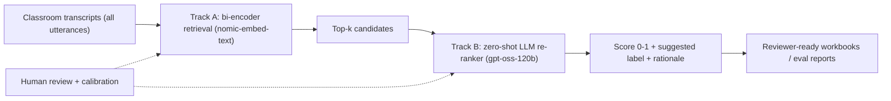

# Classroom Science-Talk Retrieval

A modular NLP pipeline for **retrieving novel classroom science-practice talk** from
early-childhood classroom transcripts, using UF-hosted large language models.

The system finds the rare moments of *science-practice talk* (observing, predicting,
causal reasoning, appealing to evidence, naming science content) inside large volumes
of everyday classroom conversation, and produces reviewer-ready outputs for expert
verification.

> Note: raw transcripts, trained model weights, embeddings, caches, and all scored
> outputs are intentionally **not** included in this repository (see
> [Data & artifacts](#data--artifacts)).

## Approach

A two-stage **retrieve-and-rerank** design:



- **Track A - bi-encoder retrieval:** a fine-tuned `nomic-embed-text-v1.5` dense
  retriever, trained contrastively with in-batch negatives, mined hard negatives, and
  LLM-generated register-variant paraphrases.
- **Track B - LLM re-ranker:** a zero-shot `gpt-oss-120b` pair judge with a strict
  rubric, caching, cost ledger, and automatic multi-key budget rotation.
- **LLM augmentation:** `llama-3.3-70b-instruct` generates register variants and hard
  negatives.
- **Human-in-the-loop:** expert review sheets, confidence scoring, and calibration keep
  the tool honest and measurable.

See [architecture_diagram.png](architecture_diagram.png), [DOCUMENTATION.md](DOCUMENTATION.md),
and [FUNCTION_REFERENCE.md](FUNCTION_REFERENCE.md) for full details.

## Pipeline steps

| Step | Module | Purpose |
| --- | --- | --- |
| 0 | [src/llm_client_0.py](src/llm_client_0.py) | LLM/embedding client, on-disk caching, retries, timeouts |
| 1 | [src/data_loader_1.py](src/data_loader_1.py) | Load + normalize labeled examples into `corpus.parquet` |
| 2 | [src/subtypes_2.py](src/subtypes_2.py) | LLM-backed science sub-type labeling |
| 3 | [src/negatives_3.py](src/negatives_3.py) | Mine non-science negatives (transcripts, LLM, seed words) |
| 4 | [src/augment_4.py](src/augment_4.py) | LLM augmentation: register variants + hard negatives |
| 5 | [src/embeddings_baseline_5.py](src/embeddings_baseline_5.py), [src/confidence_5.py](src/confidence_5.py) | Frozen-baseline embeddings + confidence scoring & routing |
| 6 | [src/review_6.py](src/review_6.py) | Human review application |
| 7 | [src/splits.py](src/splits.py), [src/positives_mining.py](src/positives_mining.py) | Train/dev/test splits, hard-informal slice, real-positive mining |
| 8 | [src/biencoder_8.py](src/biencoder_8.py) | Bi-encoder fine-tuning + corpus embedding |
| 9 | [src/reranker_9.py](src/reranker_9.py) | Zero-shot LLM pair re-ranker + calibration |
| 10 | [src/query_10.py](src/query_10.py) | Query-time classify() pipeline (retrieve + rerank) |
| 11 | [src/evaluate_11.py](src/evaluate_11.py) | Evaluation, ablation, and threshold tuning |
| 12 | [src/deploy_y2_12.py](src/deploy_y2_12.py) | Y2 transcript scoring / deployment (incremental, resumable) |

Orchestration helpers live in [src/pipeline.py](src/pipeline.py); tests are under
[tests/](tests/); prompts under [prompts/](prompts/); configuration under
[config/](config/).

## Setup

```bash
python -m venv .venv && source .venv/bin/activate
pip install -r requirements.txt
```

Create a `.env` in the project root (never commit it):

```dotenv
LLM_API_KEY=your-key
# Optional additional keys for automatic budget rotation:
LLM_API_KEY_2=...
LLM_API_KEY_3=...
LLM_MODEL_TRACKA=nomic-embed-text-v1
LLM_MODEL_TRACKB=gpt-oss-120b
LLM_MODEL_AUGMENT=llama-3.3-70b-instruct
COMPLETION_URL=https://api.ai.it.ufl.edu/v1/chat/completions
EMBEDDING_URL=https://api.ai.it.ufl.edu/v1/embeddings
```

## Usage

Each step is runnable as a module. Examples:

```bash
# Train / fine-tune the bi-encoder (Step 8)
python src/biencoder_8.py

# Evaluate + tune thresholds (Step 11)
python src/evaluate_11.py

# Score Y2 transcripts (Step 12), budget-capped and resumable
python src/deploy_y2_12.py --all --dollar-cap 25
```

Run the test suite:

```bash
pytest -q
```

## Data & artifacts

The following are **git-ignored** and must be supplied locally:

- `data/` - raw and processed transcripts and parquet artifacts
- `models/`, `checkpoints/` - trained bi-encoder weights
- `cache/` - LLM/embedding response cache
- `reports/` - scored outputs, review workbooks, run logs, eval reports
- `.env` - API credentials

## Repository layout

```
config/        JSON configs per step
prompts/       LLM prompt templates
src/           pipeline modules (steps 0-12)
scripts/       supporting scripts (deck/writeup/review bundle builders)
tests/         pytest suite
notebooks/     exploratory notebooks
DOCUMENTATION.md, FUNCTION_REFERENCE.md   detailed docs
```

## License

Research code; no license granted for redistribution unless stated by the authors.
